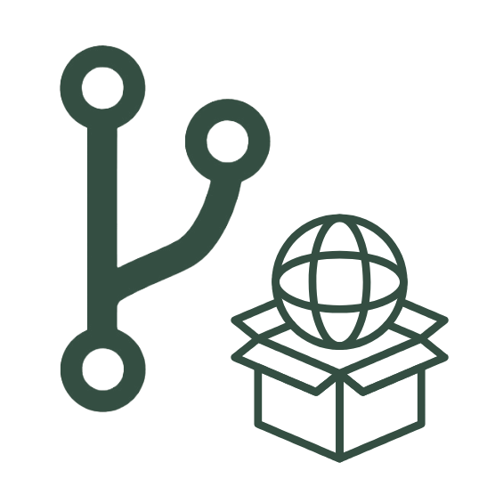

# Welcome to packageR

<figure markdown>
  { width="200" }
</figure>

Welcome to packageR, a comprehensive tool suite designed to enhance collaboration on large datasets while ensuring secure access and seamless sharing. packageR merges the robust functionalities of Git and Git Annex with integrated support for presigned URLs, utilizing standard S3 capabilities to reference potentially large data objects stored in the cloud.

In contrast to proprietary solutions, packageR harnesses widely accepted open-source tools, empowering you to manage and share data packages without requiring specialized infrastructure. This flexibility enhances standard workflows by providing an API that:

- Streamlines external data registration by leveraging Git Annex functionality to simplify the creation of cohesive data packages.
- Facilitates the generation of presigned URLs for various object storage solutions, including AWS S3, MinIO, and Ceph RadosGW, while utilizing the permission systems of your chosen Git provider (GitHub or GitLab) for robust access control.

## How Does packageR Compare to Other Data Management Tools Like Git LFS, Git Annex, or DVC?

packageR is not designed to replace existing tools but to leverage them for improved data collaboration. By incorporating Git Annex, packageR streamlines data consumption processes and can also integrate with DVC following similar principles. This approach provides essential functionality for seamless access to external remotes while maintaining the flexibility of scalable external storage solutions. In contrast, Git LFS can face bottlenecks when managing larger files and a higher volume of objects, making Git Annex a more scalable alternative.

## Only One Piece of the Larger Data Management Puzzle

packageR primarily facilitates data sharing and distribution. For scalable and collaborative data product creation, we encourage you to explore the managed solution offerings of [Versioneer](https://versioneer.at), which integrates with any commodity object storage, offering powerful features such as:

- Stable snapshots to capture and preserve specific states of your data for consistent access.
- Time travel capabilities to navigate through different versions of your data easily.
- Data deduplication to optimize storage by eliminating redundant data.
- Automated data expiration to manage data lifecycle effectively.

These capabilities can be seamlessly integrated into your Git or extended Git Annex/DVC workflows, enhancing your overall data management strategy.

## The Data Management Shared Responsibility Model

At packageR, we advocate for solid engineering practices as a foundational element of successful data management. It’s essential for users to adopt appropriate engineering methodologies first, as this sets the stage for operators to introduce the right tools to support those practices effectively. In the realm of large-scale, high-volume data management, achieving success is inherently a shared responsibility.

By embracing these principles, teams can leverage packageR alongside other tools to significantly enhance their data management capabilities, ultimately leading to greater collaborative success and improved outcomes.
